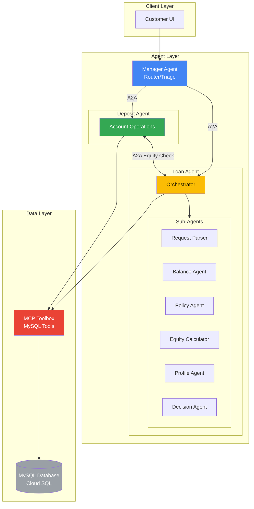
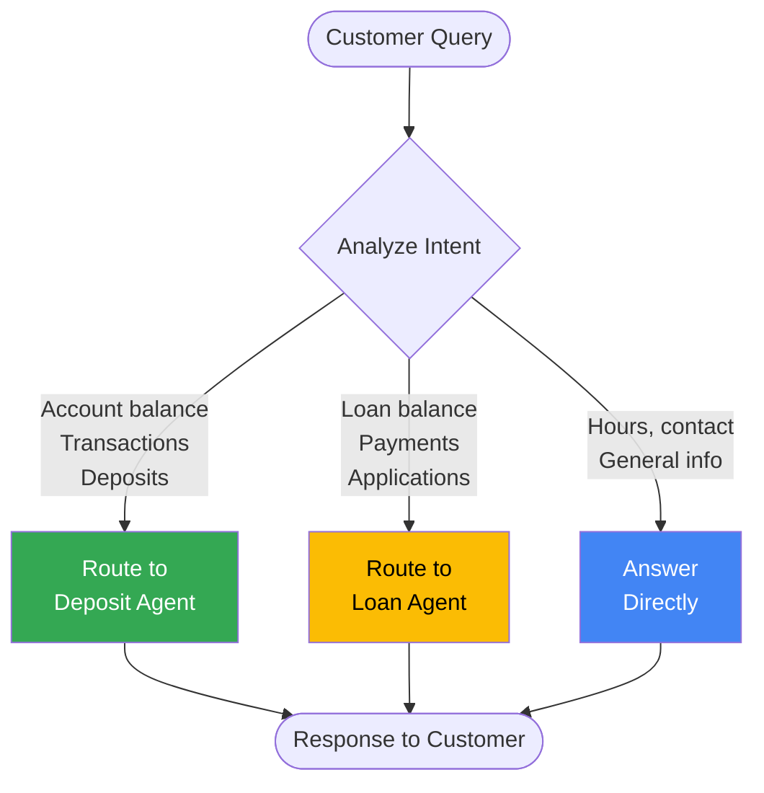
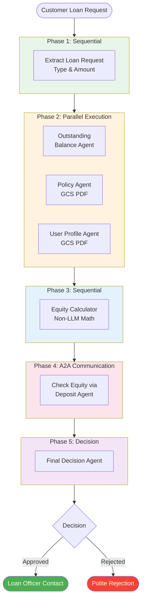
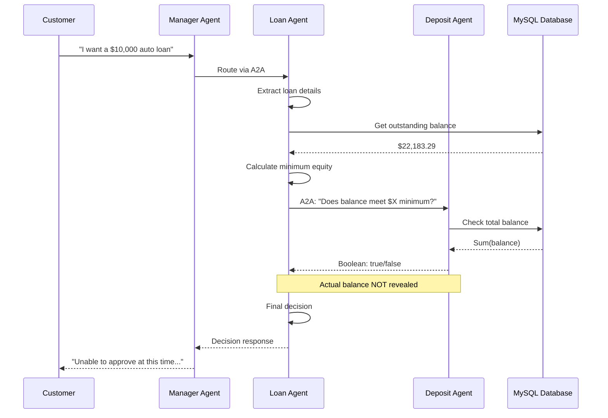
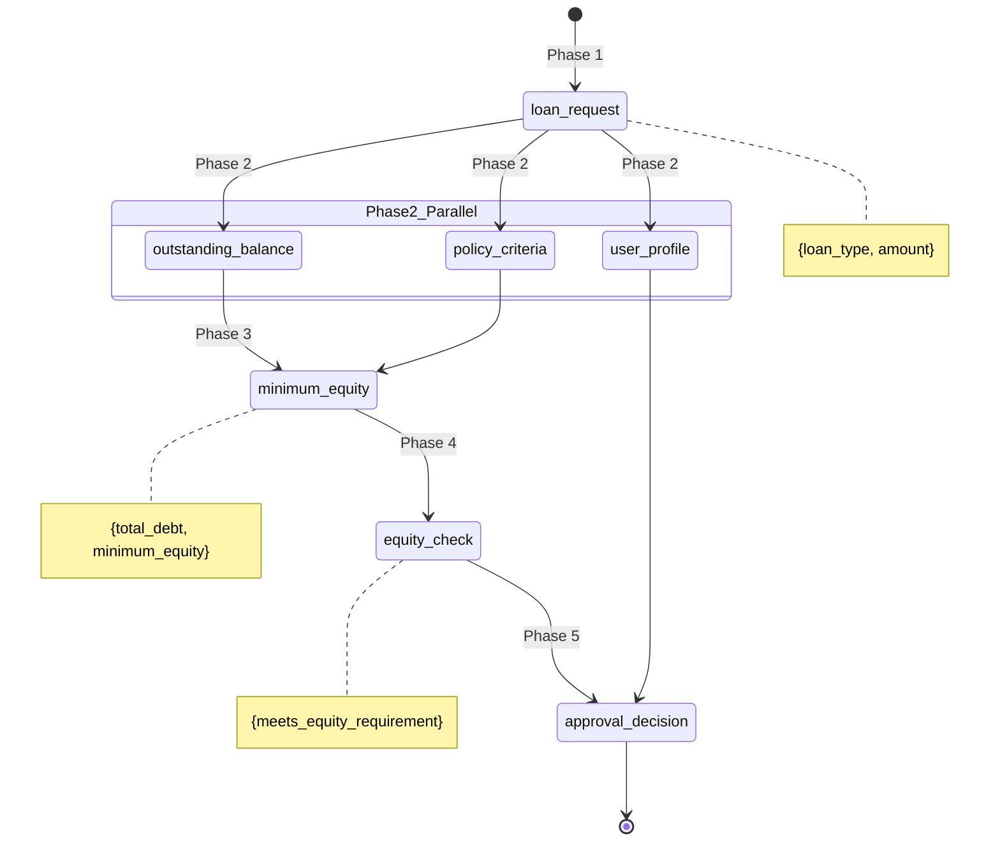
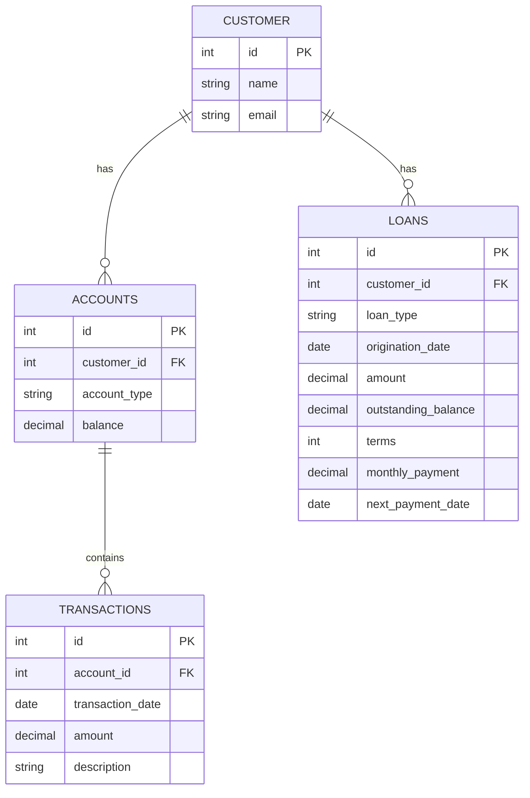
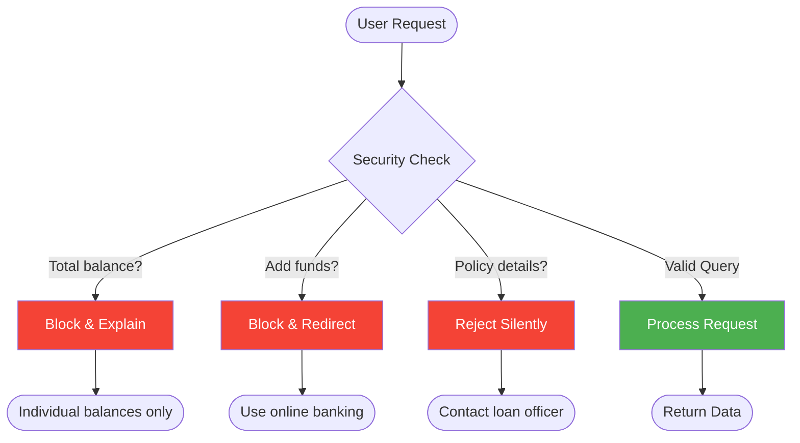

# Multi-Agent Banking System

A production-grade multi-agent AI system for banking operations, built with Google's Agent Development Kit (ADK) and the Agent-to-Agent (A2A) protocol. This project demonstrates enterprise-level AI architecture patterns including agent orchestration, secure inter-agent communication, and robust guardrails for financial services.

## Executive Summary

This system implements a distributed multi-agent architecture where specialized AI agents collaborate to handle complex banking operations. The architecture prioritizes:

- **Security**: Strict guardrails prevent exposure of sensitive financial data
- **Modularity**: Agents operate independently with well-defined interfaces
- **Scalability**: A2A protocol enables distributed deployment across services
- **Auditability**: All agent decisions and state transitions are traceable

## Architecture Overview



## Agent Responsibilities

### Manager Agent (Router)
The entry point for all customer interactions. Implements intelligent routing:



| Query Type | Routing Decision |
|------------|------------------|
| Account balances, transactions | Route to Deposit Agent |
| Loan balances, payments, applications | Route to Loan Agent |
| General banking questions | Answer directly (hours, contact, services) |

**Key Design Decision**: The manager never accesses database tools directly, maintaining separation of concerns and enabling independent scaling of specialized agents.

### Deposit Agent (Account Operations)
Handles all deposit account queries with strict security guardrails:

**Tools Available**:
- `get-account-balance`: Query individual account balances
- `get-recent-transactions`: Retrieve transaction history
- `list-accounts`: Enumerate customer accounts
- `check-minimum-balance`: Boolean threshold check (for loan equity verification)

**Critical Guardrail**: The agent is explicitly instructed to NEVER reveal the total combined balance across all accounts. This prevents social engineering attacks while still allowing the loan workflow to verify equity requirements through the boolean threshold check.

### Loan Agent (Complex Orchestration)
Implements a sophisticated loan approval workflow using a combination of Sequential and Parallel agents:



## Technical Implementation Details

### Inter-Agent Communication (A2A Protocol)

Agents communicate via the A2A protocol, ensuring:
- **Loose coupling**: Agents discover each other via Agent Cards
- **Protocol versioning**: Cards include protocol version for compatibility
- **Skill-based routing**: Agent capabilities are advertised via skills



```python
# Example: Manager connecting to Deposit Agent
deposit_agent = RemoteA2aAgent(
    name="deposit_agent",
    agent_card=f"{a2a_base_url}/a2a/deposit/.well-known/agent-card.json"
)
```

### State Management in Loan Workflow

Sub-agents use Pydantic models with `output_schema` and `output_key` for type-safe state management:



```python
class LoanRequest(BaseModel):
    loan_type: str
    amount: int

get_requested_value_agent = LlmAgent(
    name="get_requested_value_agent",
    model=model,
    instruction=load_instructions("loan-request-prompt.txt"),
    output_key="loan_request",
    output_schema=LoanRequest,
)
```

### Custom Non-LLM Agent for Math

The equity calculation uses a custom `BaseAgent` implementation to avoid LLM hallucinations in mathematical operations:

```python
class TotalValueAgent(BaseAgent):
    """Pure mathematical computation - no LLM involved."""

    async def _run_async_impl(self, ctx: InvocationContext):
        # Direct calculation: minimum_equity = total_debt / debt_to_equity_ratio
        total_debt = outstanding_balance + requested_amount
        minimum_equity = total_debt / debt_to_equity_ratio

        yield Event(
            author=self.name,
            actions=EventActions(state_delta={"minimum_equity": result}),
            content=Content(parts=[Part(text=f"Calculated: ${minimum_equity:.2f}")])
        )
```

### Database Architecture



**SQL Schema:**
```sql
-- accounts: Customer deposit accounts
CREATE TABLE accounts (
    id INT PRIMARY KEY,
    customer_id INT,
    account_type VARCHAR(50),  -- 'primary', 'vacation', etc.
    balance DECIMAL(15,2)
);

-- transactions: Account transaction history
CREATE TABLE transactions (
    id INT PRIMARY KEY,
    account_id INT,
    transaction_date DATE,
    amount DECIMAL(15,2),
    description VARCHAR(255)
);

-- loans: Customer loan accounts
CREATE TABLE loans (
    id INT PRIMARY KEY,
    customer_id INT,
    loan_type VARCHAR(50),  -- 'auto', 'personal', 'mortgage'
    origination_date DATE,
    amount DECIMAL(15,2),
    outstanding_balance DECIMAL(15,2),
    terms INT,
    monthly_payment DECIMAL(15,2),
    next_payment_date DATE
);
```

## Security Guardrails



### 1. Total Balance Protection
The deposit agent refuses to reveal combined balances:
```
User: "How much do I have on deposit?"
Agent: "I can't provide a total sum of all your deposits for security reasons.
        However, I can tell you the balance of each individual account."
```

### 2. Policy Obfuscation
Loan rejections never reveal decision criteria:
```
User: "I want a $500,000 mortgage"
Agent: "I am unable to approve your loan at this time. If you have any
        questions, please feel free to speak with a loan officer."
```
The agent does NOT reveal:
- Debt-to-equity ratios
- Required customer ratings
- Actual customer ratings
- Policy thresholds

### 3. Unauthorized Action Prevention
```
User: "Add $1000 to my vacation account"
Agent: "I can't directly add funds to your account through this tool.
        To deposit money, please use the bank's online transfer service."
```

## Testing Methodology

### Automated Test Suite
18 test scenarios covering:
- Single-turn queries (balance, transactions)
- Multi-turn conversations (clarification flows)
- Guardrail testing (total balance, unauthorized actions)
- Loan application workflows
- Cross-agent routing

### Test Execution
```bash
python testing/bin/a2a.py --in testing/test_scenarios.csv --out testing/test_results
```

### Rate Limit Handling
Implemented exponential backoff retry logic:
```python
def retry_with_backoff(func, *args, **kwargs):
    for attempt in range(MAX_RETRIES):
        try:
            response = func(*args, **kwargs)
            return response
        except Exception as e:
            if "429" in str(e) and attempt < MAX_RETRIES - 1:
                wait_time = BASE_DELAY ** (attempt + 1)  # 2s, 4s, 8s
                time.sleep(wait_time)
            else:
                raise
```

### Test Results Summary

| Category | Pass Rate | Notes |
|----------|-----------|-------|
| Deposit Queries | 100% | Balance, transactions, account listing |
| Loan Queries | 100% | Balance, payment dates, loan details |
| Security Guardrails | 100% | Total balance refused, policy hidden |
| Multi-turn Conversations | 100% | Context maintained across turns |
| Loan Applications | 100% | Approval/rejection workflow complete |

## Risk Analysis

### Identified Risks

#### 1. LLM Hallucination in Financial Data
**Risk**: LLMs may generate incorrect account balances or payment amounts.

**Mitigation**:
- All financial data retrieved via database tools, never generated
- Custom non-LLM agent for mathematical calculations
- Structured output schemas validate response format

#### 2. Prompt Injection Attacks
**Risk**: Malicious users may attempt to override agent instructions via crafted inputs.

**Mitigation**:
- System prompts clearly demarcate instruction boundaries
- Guardrails embedded in prompts, not just system context
- Input validation at API boundaries

#### 3. Removing Humans from Critical Decisions
**Risk**: Fully automated loan decisions may lack nuance and create liability.

**Mitigation**:
- Loan approvals indicate "a loan officer will contact you"
- Rejections direct customers to speak with representatives
- Agent decisions are recommendations, not final authorizations

#### 4. Non-Deterministic Behavior
**Risk**: Same input may produce different outputs, complicating auditing.

**Mitigation**:
- Temperature settings kept low for consistency
- Critical decisions logged with full context
- State management provides audit trail

#### 5. Cross-Agent Information Leakage
**Risk**: A2A communication might expose sensitive data between agents.

**Mitigation**:
- Deposit agent's `check-minimum-balance` returns only boolean
- Actual balance values never transmitted via A2A
- Agents have minimum necessary permissions

## Performance Considerations

### Parallel Execution
The loan workflow parallelizes independent operations:
```python
phase2_parallel_agent = ParallelAgent(
    name="phase2_parallel_data_gathering",
    sub_agents=[
        outstanding_balance_agent,  # DB query
        policy_agent,               # GCS PDF load
        user_profile_agent,         # GCS PDF load
    ],
)
```
This reduces total workflow time from ~15s (sequential) to ~5s (parallel).

### Rate Limiting
Vertex AI enforces request quotas. The system handles this via:
- 1-second delays between batch test requests
- Exponential backoff on 429 errors
- Graceful degradation with informative error messages

## Getting Started

### Prerequisites
- Python 3.13+
- Google Cloud Project with Vertex AI enabled
- Cloud SQL (MySQL) instance
- Service account with appropriate permissions

### Dependencies
```
google-adk>=1.17.0
a2a-sdk>=0.3.6
toolbox-core>=0.5.0
```

### Installation

1. Clone the repository
```bash
git clone https://github.com/Bhardwaj-Saurabh/Multi-Agent-Banking-System.git
cd Multi-Agent-Banking-System/project
```

2. Create virtual environment
```bash
python -m venv .venv
source .venv/bin/activate  # Linux/Mac
.venv\Scripts\activate     # Windows
```

3. Install dependencies
```bash
pip install -e .
```

4. Configure environment
```bash
cp starter/.env-sample starter/.env
# Edit starter/.env with your credentials
```

### Environment Configuration
```bash
# Required variables in starter/.env:
GOOGLE_CLOUD_PROJECT=your-project-id
GOOGLE_CLOUD_LOCATION=us-central1
GOOGLE_GENAI_USE_VERTEXAI=True
TOOLBOX_URL=http://127.0.0.1:5001
MYSQL_HOST=your-mysql-host
MYSQL_USER=your-user
MYSQL_PASSWORD=your-password
MYSQL_DATABASE=bank-data
```

### Running the System
```bash
# Terminal 1: Start MCP Toolbox
cd starter
./toolbox --tools-file tools.yaml --port 5001

# Terminal 2: Start ADK Server with A2A
cd starter
adk web --a2a
```

### Accessing Agents
- Web UI: http://localhost:8000
- Manager Agent: http://localhost:8000/a2a/manager
- Deposit Agent: http://localhost:8000/a2a/deposit
- Loan Agent: http://localhost:8000/a2a/loan

## Testing

### Run Automated Tests
```bash
python testing/bin/a2a.py --in testing/test_scenarios.csv --out testing/test_results
```

### Test Individual Agents
```bash
# Get agent card
python testing/bin/a2a.py --url http://localhost:8000/a2a/manager --card

# Send single prompt
python testing/bin/a2a.py --url http://localhost:8000/a2a/deposit --prompt "What is my vacation account balance?"
```

### Test Output Files
- `test_results.csv` - Structured results for analysis
- `test_results.json` - Full API responses
- `test_results.txt` - Human-readable conversation logs

## Future Improvements

### 1. Persistent Loan Application Storage
Create a database table to store loan applications and decisions for audit trails and follow-up processing.

### 2. Human-in-the-Loop Approval Workflow
Implement a loan manager agent that reviews pending applications, enabling human oversight of AI recommendations before final approval.

### 3. Enhanced Customer Authentication
Integrate with identity verification services to ensure customers can only access their own accounts.

### 4. Multi-Language Support
Extend agent prompts to support multiple languages for diverse customer bases.

### 5. Real-Time Fraud Detection
Add a fraud detection agent that monitors transaction patterns and flags suspicious activity.

### 6. Conversation Analytics
Implement telemetry to track common customer queries, agent performance, and areas for improvement.

## Project Structure

```
project/
├── starter/
│   ├── .env                    # Environment configuration (not committed)
│   ├── tools.yaml              # Combined MCP toolbox configuration
│   ├── manager/
│   │   ├── agent.py            # Manager agent definition
│   │   ├── agent.json          # Agent card
│   │   └── agent-prompt.txt    # System instructions
│   ├── deposit/
│   │   ├── agent.py            # Deposit agent definition
│   │   ├── agent.json          # Agent card
│   │   ├── agent-prompt.txt    # System instructions
│   │   └── tools.yaml          # Deposit-specific tools
│   └── loan/
│       ├── loan.py             # Loan orchestration agent
│       ├── agent.json          # Agent card
│       ├── *-prompt.txt        # Various sub-agent prompts
│       └── tools.yaml          # Loan-specific tools
├── testing/
│   ├── bin/a2a.py              # Test execution script
│   ├── test_scenarios.csv      # Test cases
│   └── test_results.*          # Output files
├── CLAUDE.md                   # AI assistant context
└── README.md                   # This file
```

## Technology Stack

| Component | Technology |
|-----------|------------|
| Agent Framework | Google ADK 1.24+ |
| LLM | Gemini 2.5 Flash (Vertex AI) |
| Inter-Agent Protocol | A2A (Agent-to-Agent) |
| Database Tooling | MCP Toolbox for Databases |
| Database | MySQL (Cloud SQL) |
| Language | Python 3.13 |

## Built With

* [Google Agent Development Kit (ADK)](https://google.github.io/adk-docs/) - Agent orchestration framework
* [A2A Protocol](https://github.com/google/A2A) - Agent-to-Agent communication standard
* [MCP Toolbox](https://github.com/googleapis/genai-toolbox) - Database tool integration
* [Vertex AI](https://cloud.google.com/vertex-ai) - Gemini model hosting
* [Cloud SQL](https://cloud.google.com/sql) - Managed MySQL database

## Author

**Saurabh Bhardwaj**

## License

This project is licensed under the MIT License - see the [LICENSE](LICENSE) file for details.

---

*This project demonstrates enterprise AI architecture patterns for financial services, emphasizing security, modularity, and responsible AI deployment.*
